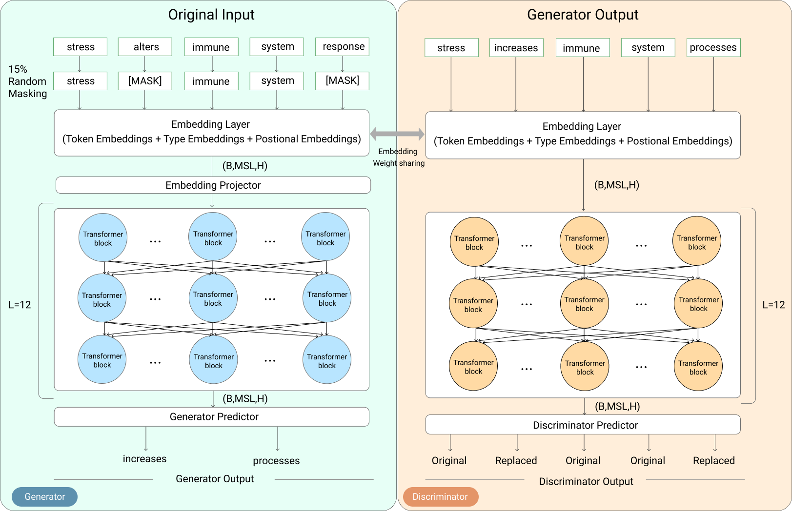
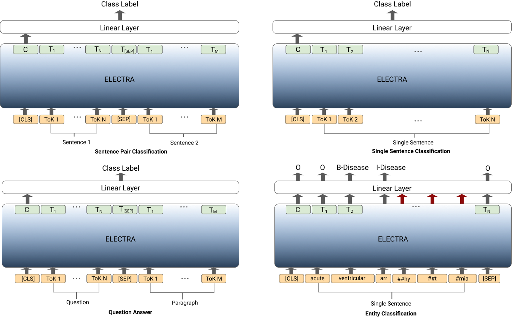

# BioELECTRA

Recent advancements in pretraining strategies in NLP have shown a significant improvement in the performance of models on various text mining tasks. In this paper, we introduce BioELECTRA, a biomedical domain-specific language encoder model that adapts ELECTRA (Clark et al., 2020) for the Biomedical domain. BioELECTRA outperforms the previous models and achieves state of the art (SOTA) on all the 13 datasets in BLURB benchmark and on all the 4 Clinical datasets from BLUE Benchmark across 7 NLP tasks. BioELECTRA pretrained on PubMed and PMC full text articles performs very well on Clinical datasets as well. BioELECTRA achieves new SOTA 86.34%(1.39% accuracy improvement) on MedNLI and 64% (2.98% accuracy improvement) on PubMedQA dataset.

For a detailed description and experimental results, please refer to our paper [BioELECTRA:Pretrained Biomedical text Encoder using Discriminators](https://www.aclweb.org/anthology/2021.bionlp-1.16/).
# Models

| Model                                       | Description                                  | Link                                                                         |
|---------------------------------------------|----------------------------------------------|------------------------------------------------------------------------------|
| BioELECTRA-base-discriminator-PubMed        | Pretrained on PubMed                         | https://huggingface.co/kamalkraj/bioelectra-base-discriminator-pubmed        |
| BioELECTRA-base-discriminator-PubMed-PMC    | Pretrained on PubMed and PMC                 | https://huggingface.co/kamalkraj/bioelectra-base-discriminator-pubmed-pmc    |
| BioELECTRA-base-discriminator-PubMed-PMC-LT | Pretrained on PubMed and PMC Longer Training | https://huggingface.co/kamalkraj/bioelectra-base-discriminator-pubmed-pmc-lt |

# Code

Model pretrainig and finetuning is done using the code opensourced by [electra](https://github.com/google-research/electra) authors.
Code used for BioELECTRA model training and finetuning - [here](https://github.com/kamalkraj/electra)

### Pretraining

PubMed data download script for pretraining is used from [NVIDIA/DeepLearningExamples](https://github.com/NVIDIA/DeepLearningExamples/tree/master/TensorFlow/LanguageModeling/BERT/biobert)

Code for Downloading and Preprocessing PubMed Abstracts [here](https://github.com/kamalkraj/BioNLP-Corpus)

### Finetuning

All the experiments are done using gcloud TPU-V3-8 instance and n2-highmem-2 (2 vCPUs, 16 GB memory).

This research was supported by Google’s TensorFlow Research Cloud (TFRC).
